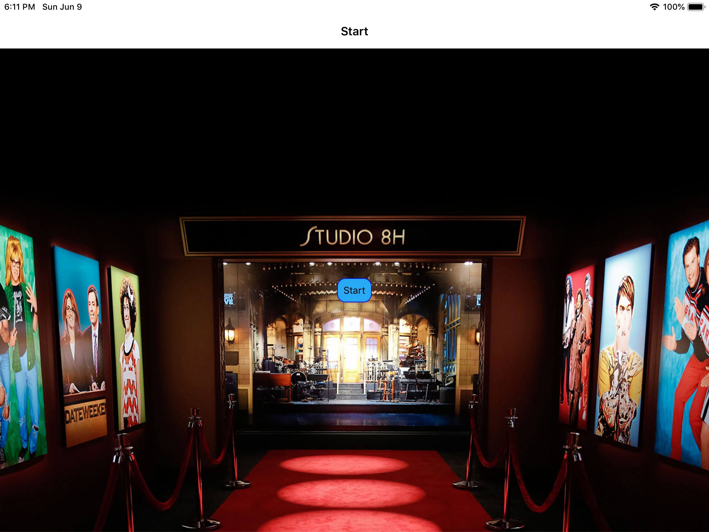
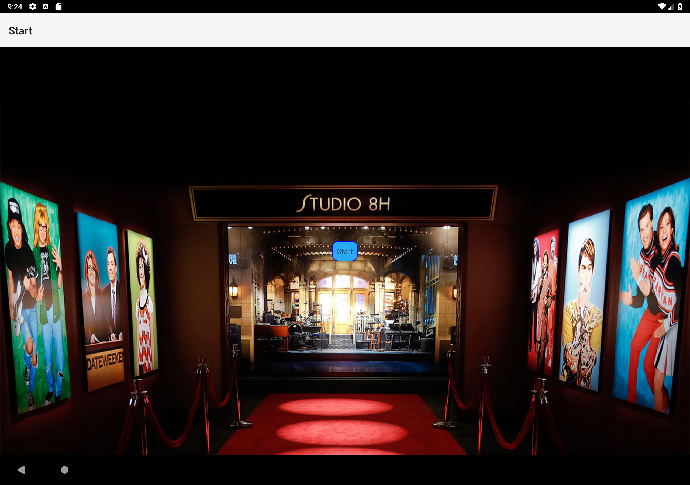
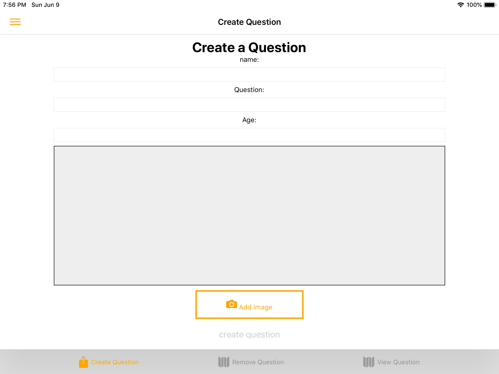
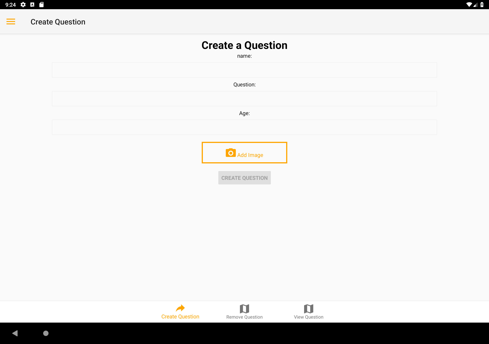
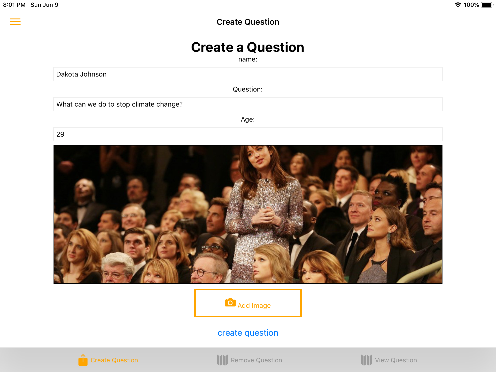
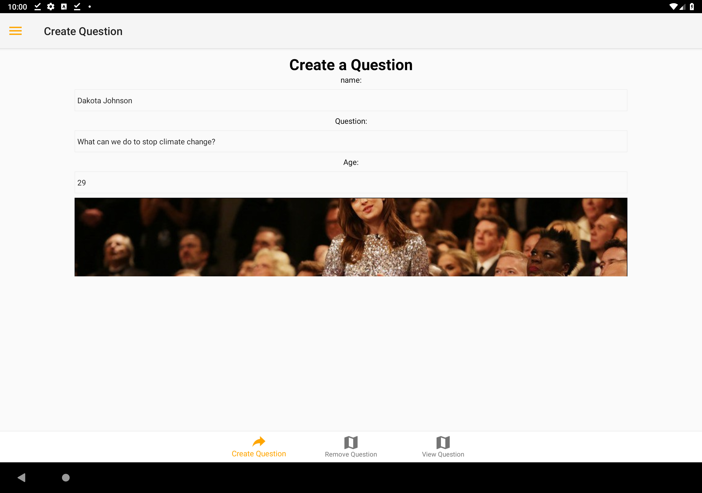
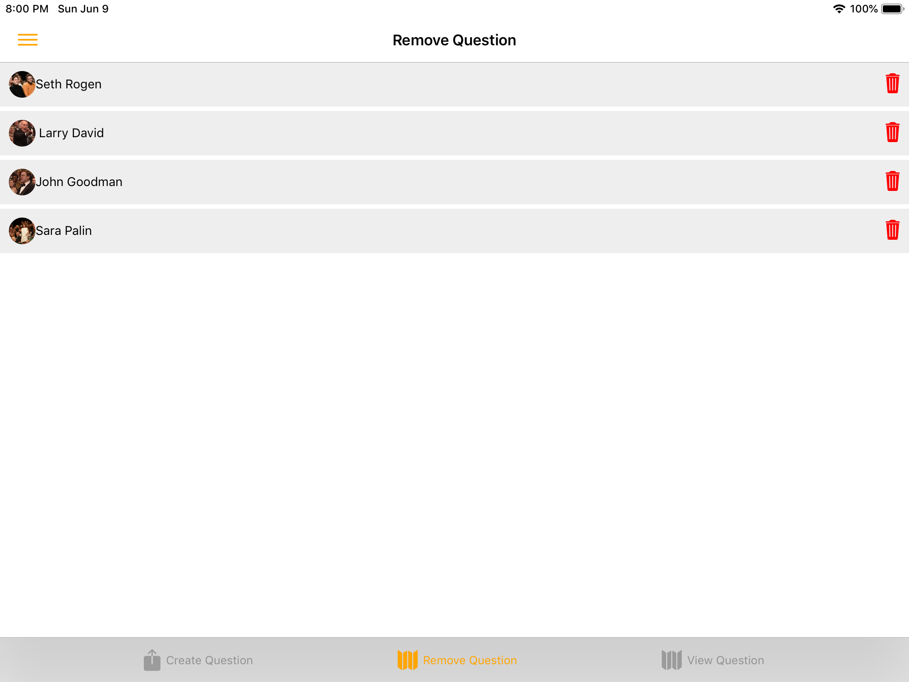
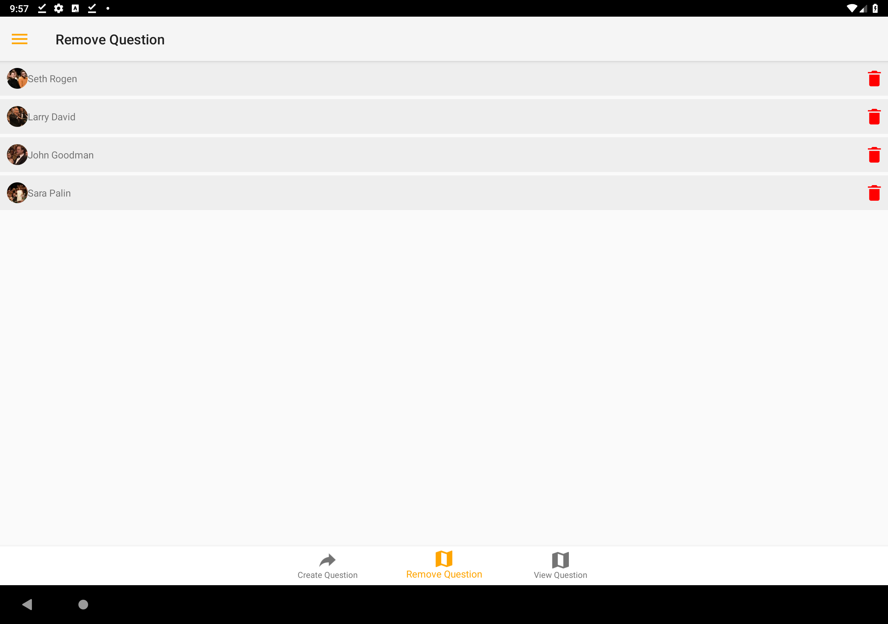
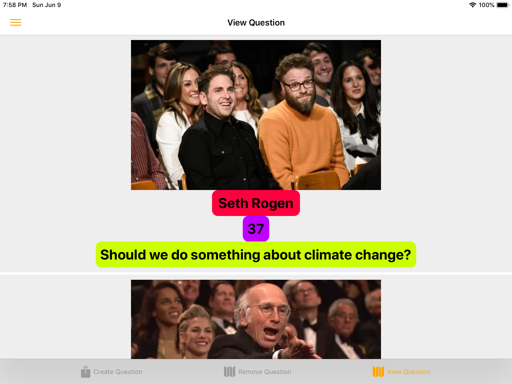
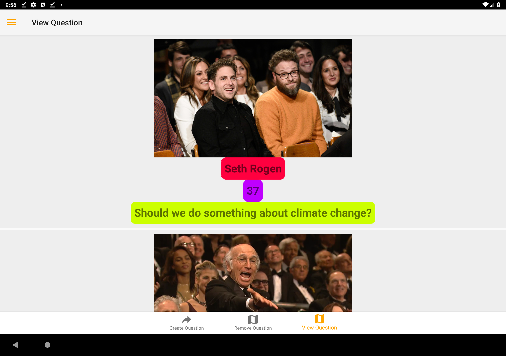

(setq markdown-css-paths '("readme.css"))
# IOS simulator
## to run
```
react-native run-ios
```
## only to open ios simulator 
```
open -a Simulator
```


# Android emulator
## save in bash profile
```
open ~/.bash_profile     
```
### copy all and paste in bash profile
```
## Android emulator
export ANDROID_HOME=$HOME/Library/Android/sdk
export PATH=$PATH:$ANDROID_HOME/emulator
export PATH=$PATH:$ANDROID_HOME/tools
export PATH=$PATH:$ANDROID_HOME/tools/bin
export PATH=$PATH:$ANDROID_HOME/platform-tools
```
## List all avd
```
emulator -list-avds
```
## open example
```
emulator -avd Pixel_2_Edited_API_28
```
## run
```
react-native run-ios
react-native run-ios --simulator="iPad (6th generation)"
react-native run-ios --device "my-iPad"
react-native run-ios --configuration Release   --device "my-iPad"
```


Screenshots 

<table border="0">
 <tr>
    <td><b style="font-size:30px">iOS</b></td>
    <td><b style="font-size:30px">Android</b></td>
 </tr>

 <tr>
    <td>
    
    </td>
    <td>
    
    </td>
 </tr>

   <tr>
    <td>
    
    </td>
    <td>
    
    </td>
 </tr>

  <tr>
    <td>
    
    </td>
    <td>
    
    </td>
 </tr>

  <tr>
    <td>
    
    </td>
    <td>
    
    </td>
 </tr>

  <tr>
    <td>
    
    </td>
    <td>
    
    </td>
 </tr>

</table>